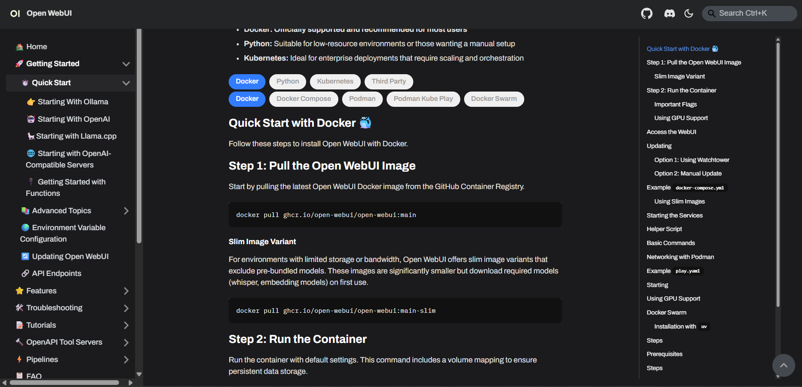
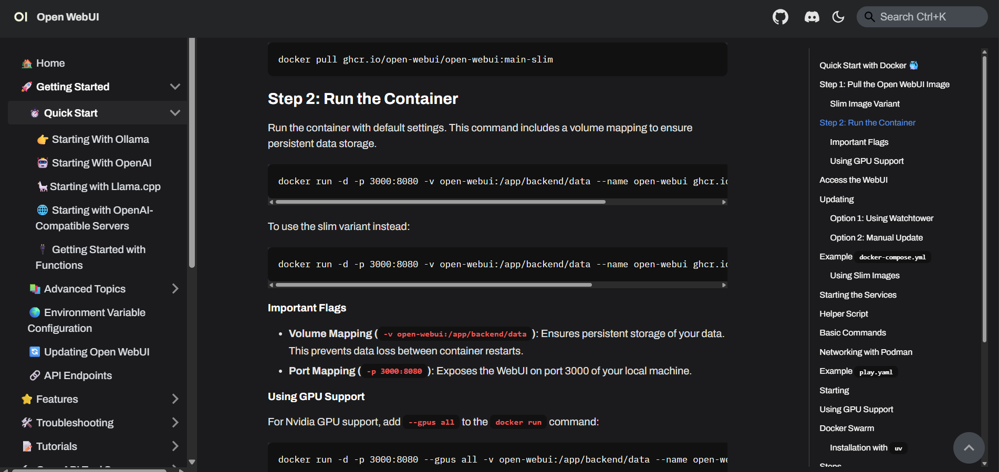
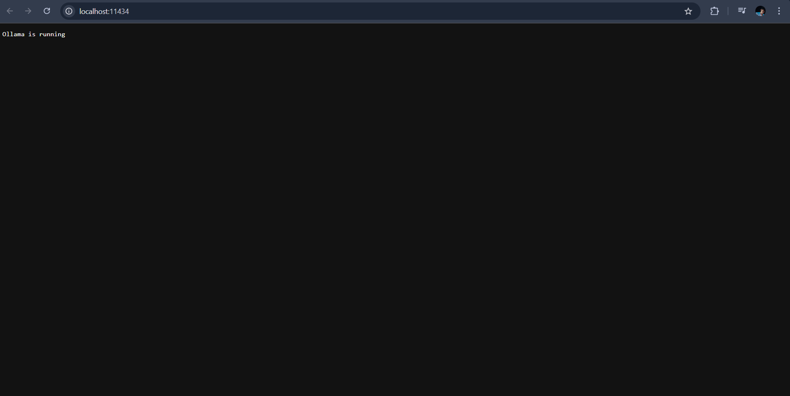
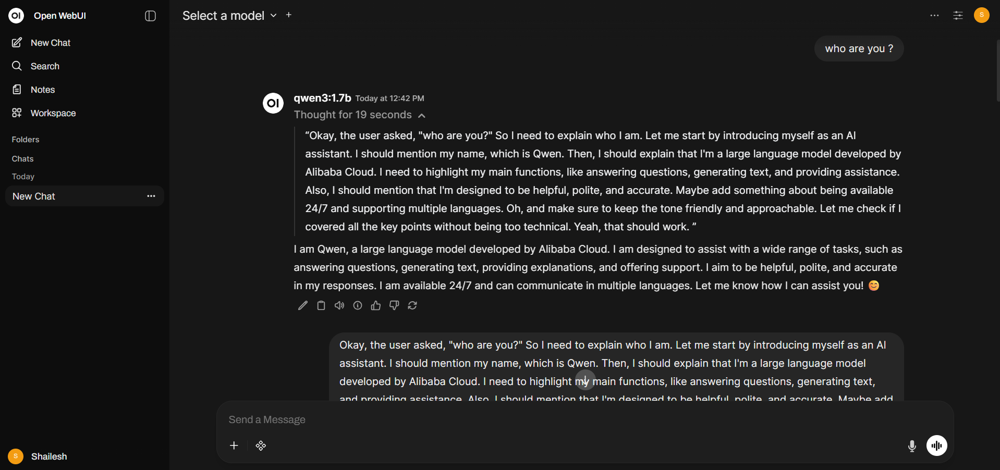

## This project's whole purpose is to run LLMs locally and to make use of them using RestAPI in Python using - FastAPI.

## Requirements

1. Docker installed on your system.
2. Ollama as a Docker image, running as a container.
3. OpenWebUI image running as a container.
4. After installing both, Ollama backend should be on port `11434` and OpenWebUI interface on port `3000`.
5. Login to OpenWebUI and download any required open-source model from Ollama.  
   [OpenWebUI Installation Guide](https://docs.openwebui.com/getting-started/quick-start/)

---

## Precise instructions: step-by-step guide to install OpenWebUI on Docker

**Step 1: Pull the latest OpenWebUI Docker image**
using the command :

```bash
docker pull ghcr.io/open-webui/open-webui:main
```



step 2: Run the Container.
Run the container with default settings. This command includes a volume mapping to ensure persistent data storage.
using the command :

```bash
docker run -d -p 3000:8080 -v open-webui:/app/backend/data --name open-webui ghcr.io/open-webui/open-webui:main
```



After successfull run of the ollama container you'll see something as:


After successfull run of the OpenWebUI container you'll see something as:

